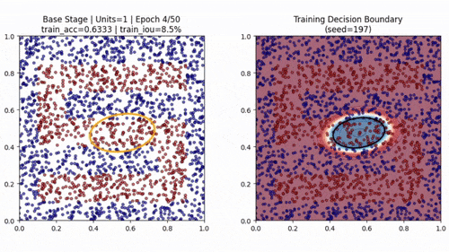
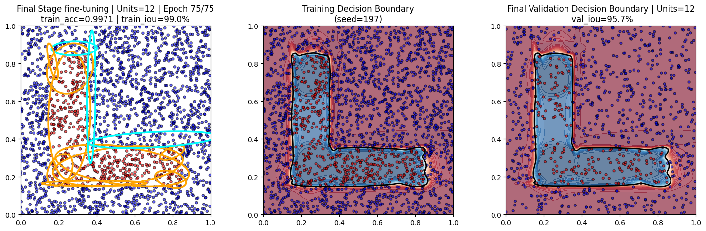
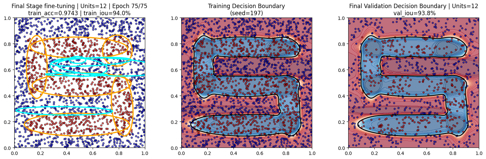
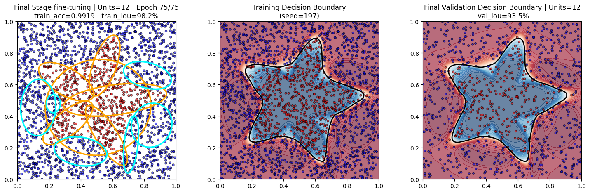
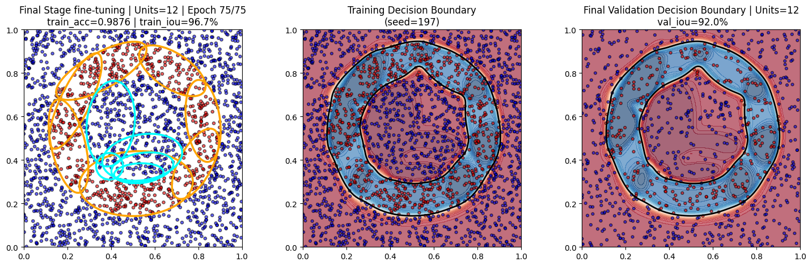
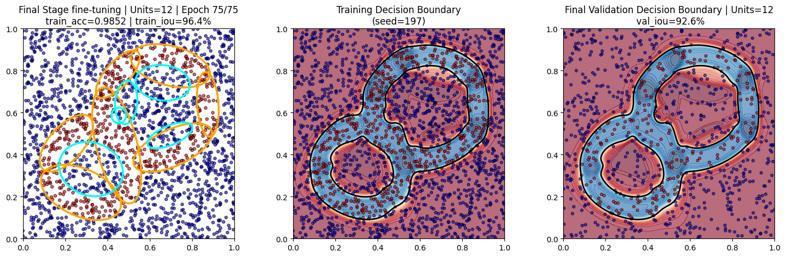
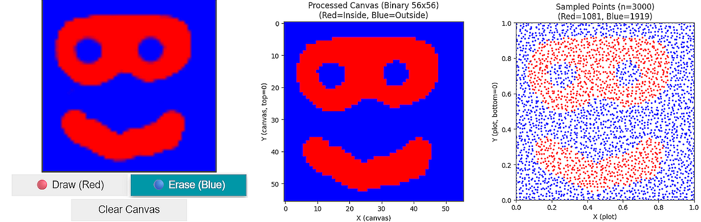
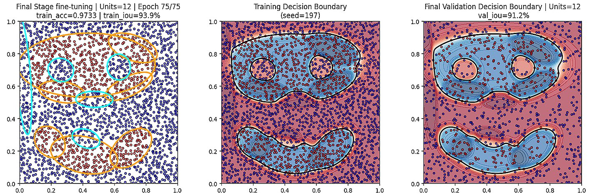

# Soft Ellipse RBF for Non-Convex Shape Classification

[](https://www.python.org/)
[](https://tensorflow.org/)
[](LICENSE.md)

_A neural network approach using Soft Elliptical Radial Basis Functions for non-convex shape classification with incremental learning and real-time visualization._

## 🌟 Overview

This project demonstrates an innovative **Soft Ellipse Radial Basis Function (RBF)** network that performs non-convex shape classification through intelligent incremental learning. The algorithm strategically places elliptical RBF units to cover positive regions, refines error clusters using DBSCAN, and prunes insignificant units for optimal performance.

---

### 🎥 Demo

Quick glimpse of training on an S-shape dataset:



👉 [Watch the full 26s demo on YouTube](https://youtu.be/xSYIDTLNT4Q)

---

### Key Features

- **🔧 Soft Elliptical RBF Units**: Parameterized by center coordinates, semi-axes, rotation angle, and sigmoid sharpness
- **📊 Three-Stage Training Process**: Base → ECR (Error Cluster Refinement) → Final fine-tuning
- **🎯 DBSCAN-Guided Placement**: Intelligent unit placement based on error cluster analysis
- **⚡ Real-time Visualization**: Live training progress with decision boundary evolution
- **🎨 Interactive Canvas**: Draw custom shapes and train the model in real-time
- **📈 High Performance**: Achieves >95% IoU on complex non-convex shapes

## 🚀 Quick Start

1. **Open the Jupyter Notebook**: `soft_ellipse_rbf.ipynb`
2. **Run all cells** to see the complete pipeline in action
3. **Experiment with different shapes** using the predefined examples
4. **Try the interactive canvas** for custom shape drawing and training

## 🎯 Algorithm Overview

### Training Pipeline

The training proceeds in three strategic stages:

1. **Base Stage**: Uses DBSCAN on false negatives to guide initial unit placement
2. **ECR Stage**: Adds units targeting both false positives and false negatives  
3. **Final Stage**: Fine-tunes the complete model with optimized hyperparameters

### RBF Unit Parameters

Each elliptical RBF unit is defined by:
- **Centers**: 2D coordinates (x, y) defining ellipse center positions
- **Semi-axes**: (a, b) controlling ellipse width and height  
- **Rotation angle**: ∠°(a-axis vs. Ox) for ellipse orientation  
- **Sigmoid sharpness**: K=10 for soft boundary transitions

## 📊 Experimental Results

The notebook showcases training on various challenging non-convex shapes:

### L-Shape Classification


### S-Shape Classification  


### 5-Star Classification


### Donut Shape Classification


### Figure-Eight Classification


---

## Custom Shape Classification — Draw Your Own Shape 😉
### Canvas Input
 

### Classification


## 🔧 Technical Implementation

### Core Components

- **Soft Ellipse RBF Layer**: Custom TensorFlow layer implementing elliptical basis functions
- **Incremental Model Architecture**: Dynamic unit addition with automatic scaling
- **DBSCAN Clustering**: Error analysis for strategic unit placement
- **Fast Medoid Selection**: Optimal center point selection for RBF units
- **Volume-based Pruning**: Removes insignificant units (threshold: 1e-3)

### Key Algorithms

```python
# Soft elliptical RBF computation
def call(self, inputs):
    # Transform inputs to ellipse coordinate system
    # Apply soft sigmoid activation for smooth boundaries
    return sigmoid_activations

# Strategic unit placement via DBSCAN
def get_max_cluster(false_points, eps, min_samples):
    # Identify largest error cluster
    # Return cluster points for RBF placement
    return cluster_size, cluster_points
```

## 🎨 Interactive Features

### Drawing Canvas

The notebook includes an interactive drawing interface (requires `ipycanvas`):

- **Draw custom shapes** directly on a canvas
- **Train the model** on your hand-drawn designs  
- **Observe real-time adaptation** to organic shapes
- **Experiment with different complexities**

```python
# Sample usage for canvas training
X_canvas, y_canvas = sample_canvas_points(n=3000)
model, iou, _, _, _, _ = build_and_train_model(
    X_canvas, y_canvas, 
    plot_frame_interval=5, 
    verbose=1
)
```

### Real-time Visualization

- **Training progress monitoring** with live metrics
- **Decision boundary evolution** visualization
- **RBF unit growth** and positioning tracking
- **Error analysis** and cluster identification

## 📈 Performance Metrics

The algorithm consistently achieves excellent performance across diverse shapes:

- **IoU Scores**: >95% on complex non-convex geometries
- **Training Efficiency**: Fast convergence through strategic unit placement
- **Model Interpretability**: Clear elliptical decision boundaries
- **Scalability**: Handles varying shape complexities and sizes

## 🛠️ Requirements

- **TensorFlow** 2.x
- **NumPy** 
- **Scikit-learn** (for DBSCAN clustering)
- **Matplotlib** (for visualization)
- **Jupyter Notebook**
- **ipywidgets** (for live logging/plotting and interactive canvas controls)
- **ipycanvas** (optional, for drawing interface)

## 📝 Usage Examples

### Basic Shape Training

```python
# Set random seed for reproducibility
RndSeed.set_seed(197)

# Generate training data (e.g., L-shape)
l_shape_corners = [(0.15, 0.15), (0.85, 0.15), (0.85, 0.35), 
                   (0.35, 0.35), (0.35, 0.85), (0.15, 0.85)]
X, y, _ = generate_polygon_data(n=3000, corners=l_shape_corners)

# Train the model
model, iou, _, _, _, _ = build_and_train_model(
    X, y, 
    b_validation=True, 
    plot_frame_interval=5, 
    verbose=1
)
```

### Custom Shape Generation

```python
# Star shape
X_star, y_star, _ = generate_n_star_data(
    n=3000, n_corners=5, 
    inner_radius=0.22, outer_radius=0.45
)

# Donut shape  
X_donut, y_donut, _ = generate_donut_data(n=3000)

# Figure-eight
X_eight, y_eight, _ = generate_eight_shape_data(n=3000)
```

## 🤝 Contributing

PRs welcome, feel free to add shapes or improvements

## 📄 License

This project is licensed under the MIT License - see the [LICENSE](LICENSE.md) file for details.

## 🙏 Acknowledgments

- TensorFlow team for automatic differentiation & custom gradient support  
- Matplotlib for visualization  
- ipycanvas for interactive drawing  

---

## 🔗 See also

👈 *Previous*: [Convex Polygon Shape Classification with Custom Activations](<https://github.com/Dani-Luk/kaggle-wrapping-convex-shape-classifier/tree/main>)
